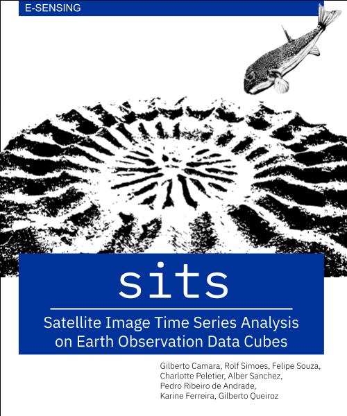

UN Handbook on Remote Sensing for Agricultural Statistics
================

### Contents of this repository

This repository contains Quarto (.qmd) files with the text of the book "UN Handbook on Remote Sensing for Agricultural Statistics". 

This book is a practical guide that enables for using remote sensing for agricultural statistics.  It provides readers with the means of producing high-quality maps of agricutural areas and prediction of crop yields. Our main target audience are national statistical authorities which are interested in improving their surveys and census using Earth observations (EO). We aim to foster a collaborative environment where they can use EO data to enhance their national land use and cover estimates, supporting sustainable development policies.

### Citation

If you use  this handbook on your work, please use this reference: 

Gilberto Camara, Lorenzo de Simone, Ronald Jansen (editors). *UN Handbook on Remote Sensing for Agricultural Statistics*. UN Statistical Division, FAO, 2025. Online book avaliable at https://fao-eostat.github.io/UN-Handbook/. 

This is work in progress. The first version is planned for launch on November 2025.

### Intellectual property rights

This book is licensed as [Attribution-NonCommercial-ShareAlike 4.0 International (CC BY-NC-SA 4.0)](https://creativecommons.org/licenses/by-nc-sa/4.0/) by Creative Commons. 

### How to contribute{-}

We welcome contributions. You may suggest corrections and improvements, and also provide whole chapters with case studies. The `sitsbook` project is released with a [Contributor Code of Conduct](https://github.com/e-sensing/sitsbook/blob/master/CODE_OF_CONDUCT.md).
By contributing to this project, you agree to abide by its terms.